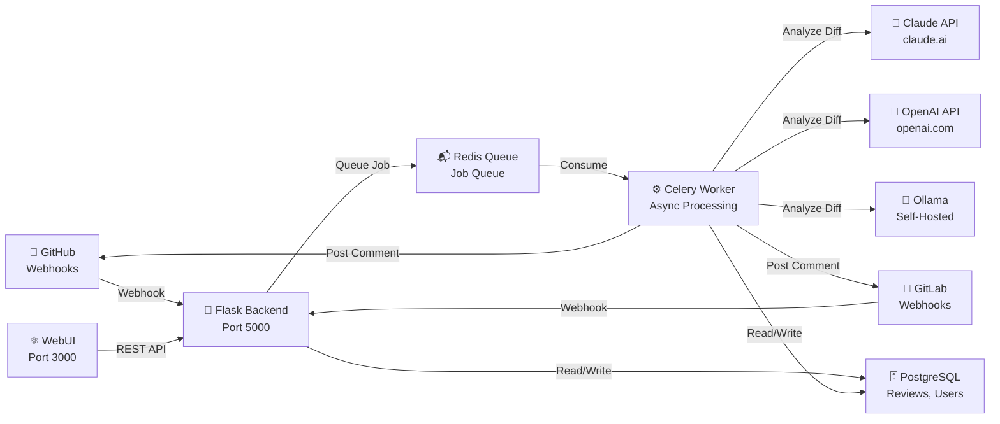

# CodeScan - Architecture & Design

**Audience:** Developers | DevOps | Admins

---

## 🏗️ High-Level Architecture

CodeScan integrates with SkausWatch as a licensed sub-module. It receives webhook events from GitHub and GitLab, processes code diffs through AI providers, and posts review comments back to pull requests/merge requests.



---

## 📊 Review Workflow

When a pull request is opened on GitHub or GitLab:

```
1. Webhook Received
   └─> Flask Backend receives GitHub/GitLab webhook
   └─> Validate webhook signature (HMAC-SHA256)
   └─> Extract PR metadata (number, title, diff, author)

2. Job Queued
   └─> Create review record in PostgreSQL
   └─> Queue async job in Redis
   └─> Respond to webhook (200 OK)

3. Async Processing (Celery Worker)
   └─> Fetch PR diff from GitHub/GitLab API
   └─> Parse code changes (added/modified files)
   └─> For each enabled category (security, best practices, framework, iac):
       ├─> Build AI prompt with code context
       ├─> Send to AI provider (Claude/OpenAI/Ollama)
       └─> Collect structured feedback

4. Comment Posting
   └─> Format review results as PR comment
   └─> Post comment via GitHub/GitLab API
   └─> Update review status in PostgreSQL (completed)

5. Audit & Metrics
   └─> Log review activity
   └─> Track token consumption
   └─> Update cost metrics
```

---

## 🔌 Webhook Endpoints

### GitHub Webhook Handler

**Endpoint**: `POST /api/v1/webhooks/github`

**Signature Verification**:
- Header: `X-Hub-Signature-256`
- Algorithm: HMAC-SHA256
- Format: `sha256={hex_digest}`
- Secret: `CODESCAN_GITHUB_WEBHOOK_SECRET`

**Supported Events**:
- `pull_request` (opened, synchronize, reopened)
- `issues` (opened, edited)

**Webhook Payload** (PR example):

```json
{
  "action": "opened",
  "pull_request": {
    "number": 42,
    "title": "Add new feature",
    "body": "This PR adds...",
    "head": {
      "sha": "abc123...",
      "ref": "feature-branch"
    },
    "base": {
      "sha": "def456...",
      "ref": "main"
    },
    "user": {
      "login": "octocat"
    },
    "html_url": "https://github.com/org/repo/pull/42"
  },
  "repository": {
    "full_name": "org/repo",
    "html_url": "https://github.com/org/repo"
  }
}
```

### GitLab Webhook Handler

**Endpoint**: `POST /api/v1/webhooks/gitlab`

**Signature Verification**:
- Header: `X-Gitlab-Token`
- Algorithm: HMAC-SHA256 (compared directly)
- Secret: `CODESCAN_GITLAB_WEBHOOK_SECRET`

**Supported Events**:
- `merge_request` (open, update)
- `issues` (open, update)

---

## 🗄️ Database Schema

CodeScan uses PostgreSQL tables (shared with SkausWatch):

### Core Tables

**`reviews`** — Code review records

| Column | Type | Purpose |
|--------|------|---------|
| `id` | UUID | Review identifier |
| `platform` | enum | `github` or `gitlab` |
| `repo_full_name` | string | `org/repo` |
| `pr_number` | int | PR/MR number |
| `pr_title` | string | PR title |
| `pr_url` | string | PR/MR URL |
| `status` | enum | `pending`, `processing`, `completed`, `failed` |
| `review_result` | jsonb | Structured review feedback (security, best_practices, framework, iac) |
| `triggered_by` | UUID | User ID who triggered review |
| `created_at` | timestamp | Review creation time |
| `completed_at` | timestamp | Review completion time |
| `tenant_id` | UUID | Multi-tenancy isolation |
| `team_id` | UUID | Team scope |

**`repositories`** — Repository configuration

| Column | Type | Purpose |
|--------|------|---------|
| `id` | UUID | Repository identifier |
| `platform` | enum | `github` or `gitlab` |
| `full_name` | string | `org/repo` |
| `enabled` | bool | Enable/disable reviews |
| `webhook_secret` | string | Webhook HMAC secret |
| `ai_provider` | string | `claude`, `openai`, or `ollama` |
| `categories_enabled` | jsonb | `{security, best_practices, framework, iac}` |
| `tenant_id` | UUID | Multi-tenancy |
| `team_id` | UUID | Team scope |

**`issue_plans`** — Auto-generated implementation plans

| Column | Type | Purpose |
|--------|------|---------|
| `id` | UUID | Plan identifier |
| `platform` | enum | `github` or `gitlab` |
| `issue_number` | int | Issue/task number |
| `plan_text` | text | Generated plan (markdown) |
| `status` | enum | `generated`, `posted`, `error` |
| `cost_uusd` | int | Cost in 1/100th USD cents |
| `created_at` | timestamp | Generation time |

**`platform_identities`** — GitHub/GitLab user mapping

| Column | Type | Purpose |
|--------|------|---------|
| `id` | UUID | Mapping ID |
| `platform` | enum | `github` or `gitlab` |
| `platform_username` | string | GitHub/GitLab login |
| `platform_user_id` | string | Platform numeric ID |
| `codescan_user_id` | UUID | CodeScan user ID |
| `platform_avatar_url` | string | Profile avatar |

---

## 🧠 AI Provider Integration

### Provider Abstraction

Each AI provider (Claude, OpenAI, Ollama) implements a common interface:

```python
class AIProvider:
    def analyze_diff(self, diff: str, category: str) -> ReviewResult:
        """Analyze code diff and return structured feedback."""
        pass

    def generate_issue_plan(self, issue_title: str, issue_body: str) -> str:
        """Generate implementation plan for issue."""
        pass
```

### Prompt Engineering

CodeScan constructs context-specific prompts for each review category:

**Security Prompt** (example):
```
Analyze this code diff for security vulnerabilities.
Check for: SQL injection, XSS, hardcoded secrets, weak crypto, OWASP Top 10.
Format response as JSON with severity levels (critical, major, minor, suggestion).

Code diff:
{diff}

Provide analysis as JSON:
{ "findings": [...], "recommendations": [...] }
```

### Provider Switching

Change providers without code changes:

```bash
# Switch from Claude to OpenAI
CODESCAN_AI_PROVIDER=openai
OPENAI_API_KEY=sk-xxx
kubectl set env deployment/codescan-backend CODESCAN_AI_PROVIDER=openai
```

---

## 🔐 Security & Authentication

### Webhook Secret Validation

All webhooks are HMAC-verified before processing:

```python
def verify_github_signature(payload_body: bytes, signature: str, secret: str) -> bool:
    expected_hash = hmac.new(secret.encode(), payload_body, hashlib.sha256).hexdigest()
    return hmac.compare_digest(signature[7:], expected_hash)  # Remove 'sha256=' prefix
```

### JWT Authentication

CodeScan API endpoints use JWT tokens:

```bash
# Request
curl -H "Authorization: Bearer <token>" \
     https://codescan.example.com/api/v1/reviews

# Token issued by SkausWatch auth service
# Contains: user_id, tenant_id, roles, scopes
```

### Multi-Tenancy Isolation

Each review/repository is scoped to a `tenant_id`:

```python
# Query reviews only for authenticated tenant
reviews = db(db.reviews.tenant_id == current_user.tenant_id).select()
```

---

## 💾 Data Flow & Persistence

### Review Lifecycle

1. **Webhook Received** → Review created with `status='pending'`
2. **Job Queued** → Status remains `pending`, job in Redis queue
3. **Processing Started** → Status changes to `processing`
4. **AI Analysis** → Result stored in `review_result` JSONB column
5. **Comment Posted** → Status changes to `completed`
6. **Error** → Status changes to `failed`, error message stored

### Cost Tracking

CodeScan tracks AI spending per user/team:

```
Cost = (input_tokens × input_price) + (output_tokens × output_price)
       Example for Claude: (2000 × 0.003) + (500 × 0.015) = $13.50
```

Monthly limits enforced:

```python
current_cost = calculate_monthly_cost(tenant_id)
if current_cost > CODESCAN_MAX_MONTHLY_COST_UUSD:
    raise CostLimitExceededError("Monthly limit reached")
```

---

## 🔄 Celery Task Architecture

CodeScan uses Celery with Redis for async processing:

**Task Queue Structure**:

```
Redis Queue
├─ codescan:review:security
├─ codescan:review:best_practices
├─ codescan:review:framework
├─ codescan:review:iac
└─ codescan:plan:generation

Celery Workers
├─ review_worker (processes review tasks)
├─ plan_worker (generates issue plans)
└─ notification_worker (posts comments)
```

**Task Retry Logic**:

- AI provider timeout → Retry up to 3 times with exponential backoff
- GitHub/GitLab API error → Retry up to 3 times
- Database connection error → Retry up to 5 times
- Permanent failure → Mark review as `failed`, alert admin

---

## 📈 Metrics & Observability

CodeScan exports Prometheus metrics:

| Metric | Type | Purpose |
|--------|------|---------|
| `codescan_reviews_total` | Counter | Total reviews processed |
| `codescan_reviews_duration_seconds` | Histogram | Review processing time |
| `codescan_ai_tokens_used` | Counter | Tokens sent to AI provider |
| `codescan_cost_uusd` | Gauge | Monthly cost tracking |
| `codescan_webhook_errors_total` | Counter | Failed webhook validations |
| `codescan_celery_queue_size` | Gauge | Jobs waiting in queue |

Accessible at `/metrics` endpoint for Grafana integration.

---

## 🔗 Integration with SkausWatch Core

CodeScan shares infrastructure with SkausWatch:

| Component | Shared | Purpose |
|-----------|--------|---------|
| **PostgreSQL** | ✅ Yes | All data stored in same DB |
| **Redis** | ✅ Yes | Job queue, caching |
| **Auth System** | ✅ Yes | Uses SkausWatch JWT tokens |
| **User Management** | ✅ Yes | CodeScan users are SkausWatch users |
| **Audit Logging** | ✅ Yes | Logged to SkausWatch audit table |
| **License Server** | ✅ Yes | CodeScan features gated by license |

---

## 🚀 Scaling Considerations

### Horizontal Scaling

**Flask Backend**: Stateless, can scale horizontally
```bash
kubectl scale deployment/codescan-backend --replicas=3
```

**Celery Workers**: Independent workers, can scale per task type
```bash
kubectl scale deployment/codescan-worker-security --replicas=2
kubectl scale deployment/codescan-worker-planning --replicas=1
```

### Performance Optimization

- **Diff caching**: Cache PR diffs for 1 hour to avoid re-fetching
- **Concurrent reviews**: Process multiple reviews in parallel via Celery
- **Token optimization**: Use faster models (Haiku, GPT-4o Mini) for simple reviews
- **Batch processing**: Group similar reviews for better AI context

---

**Last Updated**: 2025-03-10
**Version**: 1.0.0
