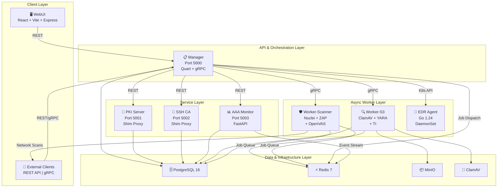
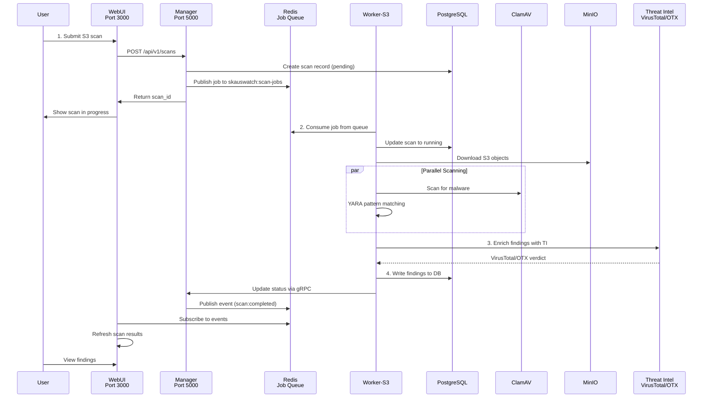
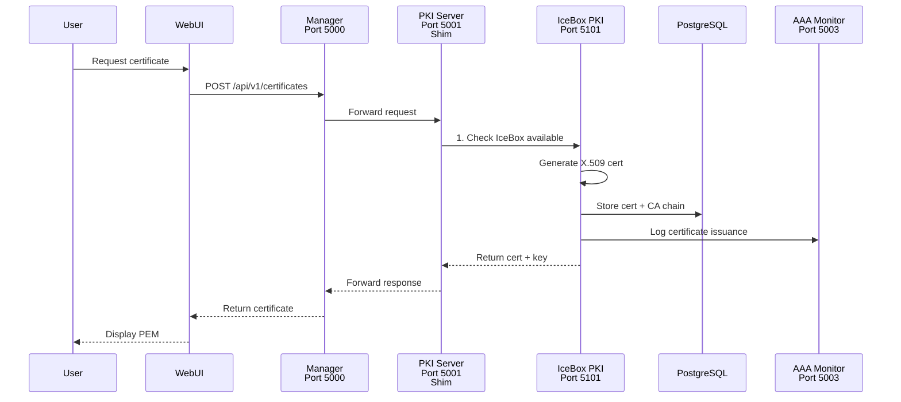

# SkausWatch System Architecture

**Audience:** Architects | Developers

Deep dive into SkausWatch's eight-service architecture, data flows, component interactions, and design decisions.

## 🏗️ Layered Architecture



## 📊 Core Data Flow: S3 Scan Lifecycle



## 🔐 Certificate & SSH Lifecycle (with IceBox)



## 🔄 Job Queue Architecture (Redis Streams)

SkausWatch uses **Redis Streams** for reliable, scalable job distribution:

```
skauswatch:scan-jobs (stream)
├─ job-1: {scan_id, bucket, profile, credentials}
├─ job-2: {scan_id, bucket, profile, credentials}
└─ job-3: {scan_id, bucket, profile, credentials}

Consumer Groups:
├─ worker-s3-group (pending delivery)
└─ worker-s3-group (acknowledged delivery)
```

**Job lifecycle:**
1. **Manager** publishes job: `XADD skauswatch:scan-jobs * ...`
2. **Worker-S3** consumes: `XREADGROUP GROUP worker-s3-group $ STREAMS skauswatch:scan-jobs`
3. Worker processes job
4. Worker acknowledges: `XACK skauswatch:scan-jobs worker-s3-group job-id`
5. Manager polls status updates via gRPC

**Why Redis Streams (not Celery/RQ):**
- Built-in consumer groups for reliable delivery
- Durable persistence (survives worker crashes)
- Atomic acknowledgment
- Integrates with existing Redis infrastructure
- Lower latency than message queues

## 🛡️ Security Architecture

### Credential Encryption

S3 credentials encrypted at rest using AES-256-GCM:
```
Flow:
1. User provides AWS credentials via WebUI
2. Manager encrypts using S3_CRED_ENCRYPTION_KEY
3. Stores encrypted blob in PostgreSQL
4. Worker-S3 decrypts on job consumption
5. Credentials used to authenticate S3 requests
6. Decrypted credentials never logged
```

### Inter-Service Authentication

**When IceBox installed:**
- All services use X.509 certificates issued by IceBox PKI
- mTLS enforcement on service-to-service communication
- Certificate validation enforced at TLS layer

**When IceBox unavailable (v1.x fallback):**
- Services communicate over HTTP with no encryption
- API endpoints protected by JWT tokens only
- Recommended only for development

### RBAC via OIDC Scopes

All API endpoints declare required scopes:
```python
@auth_required
@require_scope("scans:read")
def get_scans():
    ...

@auth_required
@require_scope("scans:write")
def create_scan():
    ...

@auth_required
@require_scope("admin")
def revoke_certificate():
    ...
```

Scopes embedded in JWT token claims, validated on every request.

## 📦 Data Model Overview

### Core Tables

**scans** (S3 scan jobs)
```sql
id UUID PRIMARY KEY
bucket_name VARCHAR(255)
status VARCHAR(50) -- pending, running, completed, failed
findings JSONB -- array of malware findings
created_at TIMESTAMP
completed_at TIMESTAMP
```

**findings** (scan results)
```sql
id UUID PRIMARY KEY
scan_id UUID (FK -> scans)
file_path VARCHAR(1000)
malware_detected BOOLEAN
threat_level VARCHAR(50) -- critical, high, medium, low
signatures JSONB -- array of detection signatures
threat_intel JSONB -- VirusTotal/OTX verdict
```

**certificates** (PKI)
```sql
serial_number VARCHAR(255) PRIMARY KEY
subject VARCHAR(1000)
issuer VARCHAR(1000)
not_before TIMESTAMP
not_after TIMESTAMP
status VARCHAR(50) -- active, revoked, expired
certificate_pem TEXT
private_key_pem TEXT (encrypted)
```

**audit_logs** (AAA Monitor)
```sql
id UUID PRIMARY KEY
user_id UUID
action VARCHAR(100)
resource_type VARCHAR(100)
resource_id UUID
status VARCHAR(50) -- success, failure
details JSONB
timestamp TIMESTAMP
```

**ssh_certificates** (SSH CA)
```sql
id UUID PRIMARY KEY
key_id VARCHAR(255)
public_key TEXT
certificate TEXT
principals JSONB -- array of principals
cert_type VARCHAR(50) -- user, host
valid_after TIMESTAMP
valid_before TIMESTAMP
```

## 🚀 Scaling Considerations

### Horizontal Scaling

**Manager (stateless API layer):**
- Run multiple instances behind load balancer
- No session affinity required
- Shares PostgreSQL and Redis backend

**Worker-S3 & Worker-Scanner (job consumers):**
- Run N parallel instances
- Each consumes from same Redis Stream group
- Load automatically balanced by consumer group

**EDR Agent (K8s DaemonSet):**
- Runs on every node
- No scaling — one per node by design
- Reports aggregated metrics to Manager

### Vertical Scaling Limits

**Worker resource constraints (hard limits):**
- Memory: 2GB (prevent runaway scans)
- CPU: 2 cores (leave headroom for other pods)
- Scan timeout: 5 minutes (prevent hung jobs)

**PostgreSQL:** Connection pool limits
- Per-service pool size: 10 connections
- Total max: ~100 connections
- Scale with RDS read replicas if needed

**Redis:** Stream backpressure
- Job queue depth monitored
- If backlog > 1000, alert DevOps to scale workers

## 🔗 Integration Points

### IceBox Sub-Module

PKI Server and SSH CA act as thin shim proxies:
```
Client Request
    ↓
[PKI Server Shim - Port 5001]
    ↓
Check: $ICEBOX_PKI_URL set?
    ├─ Yes: Forward → IceBox Port 5101
    └─ No: Return 503 "Service Unavailable"
    ↓
IceBox PKI Backend
    ↓
Response (with Deprecation headers)
```

**Shim proxy responsibilities:**
- Attach `Deprecation:` RFC 8594 header
- Forward `Link:` header with successor URL
- Proxy all request/response bodies unchanged
- Log all requests for audit trail

**Future (v2.0):** Shims removed, clients use IceBox directly

### Darwin Sub-Module

Darwin worker integrates via webhook:
```
GitHub/GitLab
    ↓ webhook
Manager (webhook receiver)
    ↓
[Darwin Worker Job]
    ↓
Worker-Darwin (subprocess)
    ↓
AI Provider (Claude/OpenAI/Ollama)
    ↓
GitHub/GitLab Comment (via API)
```

## 🎯 Design Decisions

### Why Quart over Flask?

Quart provides native async/await support while maintaining Flask compatibility. Enables:
- Non-blocking I/O for API endpoints
- Concurrent request handling
- Better resource utilization

### Why Redis Streams over Celery?

Redis Streams offer:
- Simpler deployment (no separate broker)
- Built-in consumer groups (Celery lacks this)
- Persistent, replayable message log
- Lower operational overhead

### Why PyDAL for database?

PyDAL abstracts SQL generation, allowing:
- Write-once queries for PostgreSQL/MySQL/SQLite
- Built-in input sanitization (SQL injection prevention)
- Simple syntax: `db(db.users.id == 5).select()`

### Why Go for EDR Agent?

Go provides:
- Minimal runtime footprint (single binary)
- Low memory usage (important for DaemonSet on 100+ nodes)
- Native threading model (perfect for concurrent system monitoring)
- Static linking (no dependencies)

## 📈 Performance Characteristics

| Operation | Latency | Throughput | Notes |
|-----------|---------|-----------|-------|
| Create scan | <10ms | 100 req/sec | Async job enqueue |
| Get scan status | <5ms | 1000 req/sec | Direct DB query |
| S3 scan (1GB) | 30-60s | 1 scan at a time | ClamAV + YARA sequential |
| Vulnerability scan | 5-120s | Depends on target | Nuclei (fast), ZAP (medium), OpenVAS (slow) |
| Certificate issue | <50ms | 100 cert/sec | IceBox PKI backend |
| Audit log write | <10ms | 1000 log/sec | Async Redis + DB |

## 🔮 Future Architecture (v2.0)

Planned changes:
- Remove PKI/SSH CA shim proxies (clients use IceBox directly)
- Replace Quart with native async Flask alternative (if available)
- Add horizontal scaling for PostgreSQL (read replicas + sharding)
- Introduce service mesh (Istio) for mTLS and observability

---

**Last Updated:** 2026-03-10
**Maintained by:** Penguin Tech Inc
